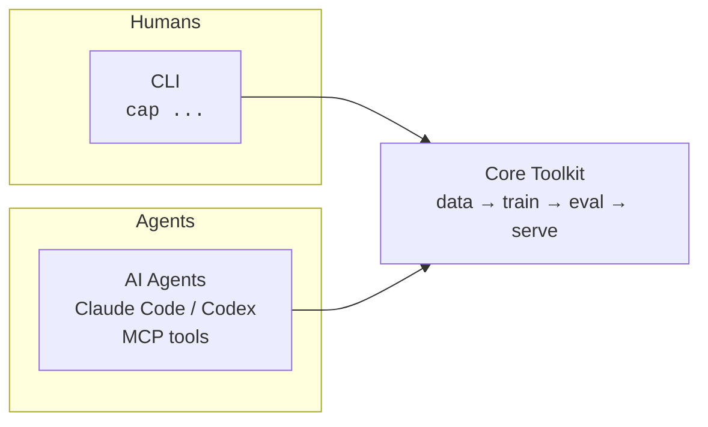
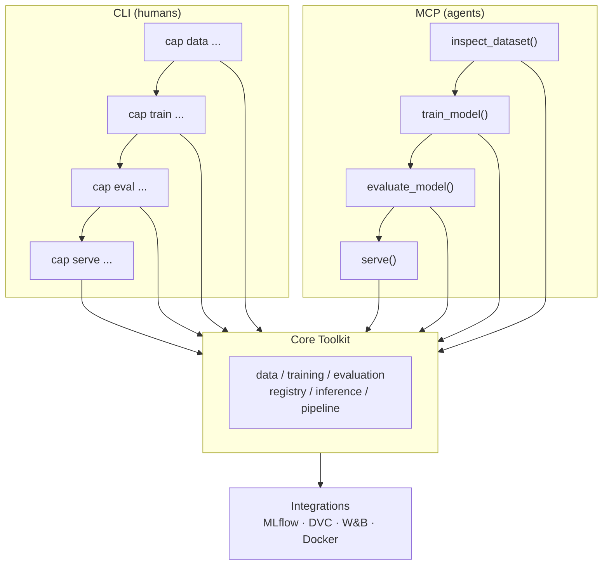
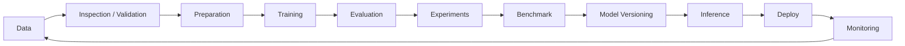

<div align="center">

# Cap Models

**One ML engineering layer. Two interfaces. Every stage covered.**

A unified ML/AI engineering layer that automates and standardizes the entire model development lifecycle — operable by **humans via CLI** and by **AI agents via MCP/API**.


[](./LICENSE)
[](https://pypi.org/project/cap-models/)
[](https://pypi.org/project/cap-models/)
[](https://github.com/masteryogo/cap-models/actions)
[](https://github.com/masteryogo/cap-models/graphs/contributors)

---

[Quick Start](#quick-start) · [Features](#core-features) · [Architecture](#architecture) · [Roadmap](#roadmap) · [Contributing](#contributing) · [**Português (PT-BR)**](./README_PT.md)

</div>

---

## What is Cap Models?

Cap Models is a **single engineering layer for the full ML/AI lifecycle** — from data inspection to production monitoring — exposed through two symmetric interfaces that share one core. The same capability is available whether you're a developer at a terminal or a coding agent with access to the MCP.



> **One layer. Two faces.** CLI and MCP are thin wrappers over a single, shared core — zero duplicated logic.

### Why Cap Models?

- **Humans and agents, equal citizens** — every function is reachable from both a terminal and an LLM, with structured (JSON) output for agents.
- **A companion, not a replacement** — integrates with MLflow, DVC, W&B and Docker instead of competing with them.
- **Observability by default** — logging, metrics, and traceability from day one.
- **Ecosystem-friendly** — a thin, opinionated layer on top of the tools you already use.
- **Community-driven** — open from day one to shape the roadmap with the ML community, especially the Brazilian ML/MLOps community.

---

## Quick Start

```bash
# Install
pip install cap-models

# Initialize an ML project
cap init

# Inspect a dataset
cap data inspect data/dataset.csv

# Run a full lifecycle pipeline
cap pipeline run --config pipeline.yaml
```

That's it. Install, initialize, and run your first end-to-end pipeline in under a minute.

---

## Core Features

| Stage | CLI | MCP Tool | What it does |
|-------|-----|----------|--------------|
| Data inspection | `cap data inspect` | `inspect_dataset()` | Schema, metrics, and anomaly detection |
| Data validation | `cap data validate` | `validate_dataset()` | Quality rules, types, and nulls |
| Data preparation | `cap dataset prepare` | `prepare_dataset()` | Cleaning, encoding, and splitting |
| Training | `cap train` | `train_model()` | Training with hyperparameters |
| Evaluation | `cap eval` | `evaluate_model()` | Metrics, reports, and plots |
| Experiments | `cap experiment compare` | `compare_experiments()` | Run ranking and diffs |
| Benchmark | `cap benchmark` | `benchmark()` | Performance benchmarking |
| Model registry | `cap model register` | `register_model()` | Versioning and registry |
| Batch inference | `cap predict` | `predict()` | Batch prediction |
| Serving | `cap infer serve` | `serve()` | Inference server |
| Orchestration | `cap pipeline run` | `run_pipeline()` | End-to-end orchestration |

---

## Architecture



```
cap-models/
├── src/
│   └── cap_models/
│       ├── cli/              # CLI interface (Click/Typer)
│       ├── core/             # Central logic
│       │   ├── data/         # Inspection, validation, preparation
│       │   ├── training/     # Training and experiments
│       │   ├── evaluation/   # Evaluation and benchmarks
│       │   ├── registry/     # Versioning and registration
│       │   ├── inference/    # Serving and batch
│       │   └── pipeline/     # Orchestration
│       ├── mcp/              # MCP tools for agents
│       └── integrations/     # MLflow, DVC, W&B, etc.
├── tests/
└── pyproject.toml
```

---

## ML Lifecycle

Cap Models is designed around the complete model lifecycle:



---

## Integrations

Cap Models composes with the ecosystem instead of reinventing it.

| Integration | Purpose |
|-------------|---------|
| **MLflow** | Experiment tracking and model registry |
| **DVC** | Data and pipeline versioning |
| **W&B** | Experiment visualization and logging |
| **Docker** | Reproducible serving and deployment |

---

## Design Principles

- **CLI and MCP are two faces of the same coin** — every feature is reachable via both.
- **Centralized core** — zero duplicated logic between interfaces.
- **Ecosystem, not a substitute** — composes with MLflow, DVC, W&B instead of competing.
- **Built-in observability** — logs, metrics, and traceability from the start.
- **Agent-friendly** — structured output (JSON) for direct LLM consumption.

---

## Roadmap

We're building Cap Models in phases.

| Phase | Focus | Status |
|-------|-------|--------|
| **Foundation** | Package skeleton, `pyproject.toml`, CI, tests | in progress |
| **Data layer** | `data inspect`, `validate`, `prepare` | planned |
| **Training & Eval** | `train`, `eval`, experiment comparison | planned |
| **Registry & Inference** | model versioning, `predict`, `serve` | planned |
| **MCP interface** | expose core as MCP tools for agents | planned |
| **Orchestration & Monitoring** | `pipeline run`, production monitoring | planned |

See the [open issues](https://github.com/masteryogo/cap-models/issues) for the most current priorities.

---

## Contributing

Cap Models is **community-driven and open to all** — especially the Brazilian ML/MLOps community. If you care about clean ML engineering or AI agents, we'd love to have you.

- Check out [CONTRIBUTING.md](./CONTRIBUTING.md) for the full guide.
- Look for [`good-first-issue`](https://github.com/masteryogo/cap-models/issues?q=is%3Aissue+is%3Aopen+label%3A%22good+first+issue%22) to get started.
- Non-trivial changes start with an issue to discuss design first.

---

## Maintainers

- **João Pedro Matos** — founder & lead maintainer ([masteryogo](https://github.com/masteryogo))

---

## Community

- **Docs** — coming soon
- **Discussions** — [GitHub Discussions](https://github.com/masteryogo/cap-models/discussions)
- **Issues** — [GitHub Issues](https://github.com/masteryogo/cap-models/issues)
- **Community** — reach out via the maintainers for Discord/Slack invites

---

## License & Citation

Cap Models is licensed under the **Apache License 2.0**. See [LICENSE](./LICENSE).

If you use Cap Models in your research or work, please cite it:

```bibtex
@software{capmodels,
  author = {Jo{\~a}o Pedro Matos and Cap Models Contributors},
  title = {Cap Models: A unified ML/AI engineering layer for humans and agents},
  url = {https://github.com/masteryogo/cap-models},
  version = {0.1.0},
  year = {2026}
}
```

---

## Português (PT-BR)

**Este projeto também fala português.** A versão em português brasileiro do README está disponível em [**README_PT.md**](./README_PT.md).
