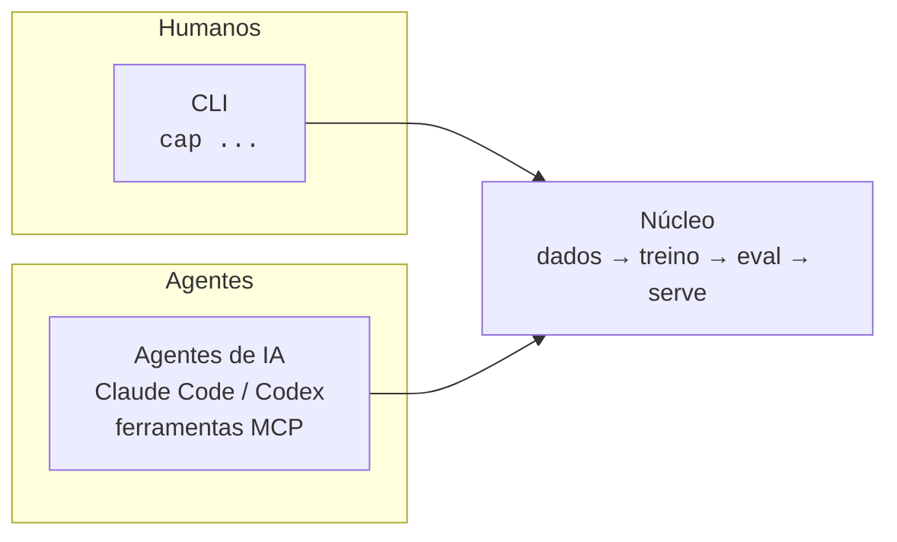
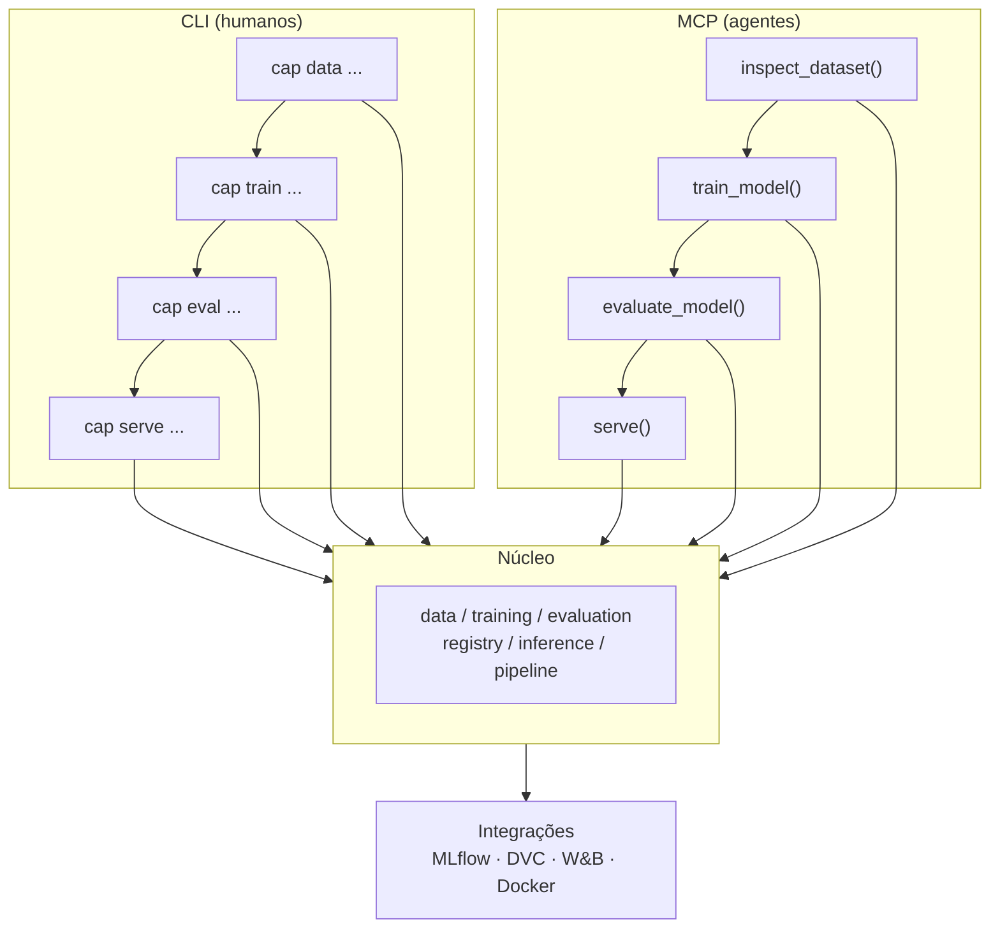
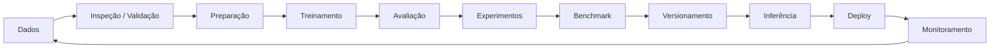

<div align="center">

# Cap Models

**Uma camada de engenharia de ML. Duas interfaces. Todas as etapas cobertas.**

Uma camada unificada de engenharia de ML/AI que automatiza e padroniza o ciclo completo de desenvolvimento de modelos — operável tanto por **humanos via CLI** quanto por **agentes de IA via MCP/API**.


[](./LICENSE)
[](https://pypi.org/project/cap-models/)
[](https://pypi.org/project/cap-models/)
[](https://github.com/masteryogo/cap-models/actions)
[](https://github.com/masteryogo/cap-models/graphs/contributors)

---

[Início Rápido](#início-rápido) · [Recursos](#recursos-principais) · [Arquitetura](#arquitetura) · [Roadmap](#roadmap) · [Contribuição](#contribuição) · [**English**](./README.md)

</div>

---

## O que é Cap Models?

Cap Models é uma **camada única de engenharia para todo o ciclo de vida de ML/AI** — da inspeção de dados ao monitoramento em produção — exposta por duas interfaces simétricas que compartilham um mesmo núcleo. A mesma capacidade está disponível tanto para um desenvolvedor no terminal quanto para um agente de codificação com acesso ao MCP.



> **Uma camada. Duas faces.** CLI e MCP são wrappers finos sobre um único núcleo compartilhado — zero lógica duplicada.

### Por que Cap Models?

- **Humanos e agentes como cidadãos iguais** — toda função está acessível tanto pelo terminal quanto por um LLM, com saída estruturada (JSON) para agentes.
- **Um complemento, não um substituto** — integra com MLflow, DVC, W&B e Docker em vez de competir com eles.
- **Observabilidade por padrão** — logs, métricas e rastreabilidade desde o primeiro dia.
- **Amigável ao ecossistema** — uma camada fina e opinativa sobre as ferramentas que você já usa.
- **Conduzido pela comunidade** — aberto desde o início para moldar o roadmap com a comunidade de ML, especialmente a comunidade brasileira de ML/MLOps.

---

## Início Rápido

```bash
# Instalar
pip install cap-models

# Inicializar um projeto de ML
cap init

# Inspecionar um dataset
cap data inspect data/dataset.csv

# Rodar um pipeline completo do ciclo de vida
cap pipeline run --config pipeline.yaml
```

Pronto. Instale, inicialize e rode seu primeiro pipeline de ponta a ponta em menos de um minuto.

---

## Recursos Principais

| Etapa | CLI | Ferramenta MCP | O que faz |
|-------|-----|----------------|-----------|
| Inspeção de dados | `cap data inspect` | `inspect_dataset()` | Schema, métricas e detecção de anomalias |
| Validação de dados | `cap data validate` | `validate_dataset()` | Regras de qualidade, tipos e nulos |
| Preparação de dados | `cap dataset prepare` | `prepare_dataset()` | Limpeza, encoding e splitting |
| Treinamento | `cap train` | `train_model()` | Treino com hiperparâmetros |
| Avaliação | `cap eval` | `evaluate_model()` | Métricas, relatórios e gráficos |
| Experimentos | `cap experiment compare` | `compare_experiments()` | Ranking e diffs entre runs |
| Benchmark | `cap benchmark` | `benchmark()` | Benchmark de performance |
| Registro de modelos | `cap model register` | `register_model()` | Versionamento e registro |
| Inferência em batch | `cap predict` | `predict()` | Predição em batch |
| Servimento | `cap infer serve` | `serve()` | Servidor de inferência |
| Orquestração | `cap pipeline run` | `run_pipeline()` | Orquestração ponta a ponta |

---

## Arquitetura



```
cap-models/
├── src/
│   └── cap_models/
│       ├── cli/              # Interface CLI (Click/Typer)
│       ├── core/             # Lógica central
│       │   ├── data/         # Inspeção, validação, preparação
│       │   ├── training/     # Treinamento e experimentos
│       │   ├── evaluation/   # Avaliação e benchmarks
│       │   ├── registry/     # Versionamento e registro
│       │   ├── inference/    # Servimento e batch
│       │   └── pipeline/     # Orquestração
│       ├── mcp/              # Ferramentas MCP para agentes
│       └── integrations/     # MLflow, DVC, W&B, etc.
├── tests/
└── pyproject.toml
```

---

## Ciclo de Vida de ML

Cap Models é projetado em torno do ciclo de vida completo do modelo:



---

## Integrações

Cap Models compõe com o ecossistema em vez de reinventá-lo.

| Integração | Propósito |
|------------|-----------|
| **MLflow** | Tracking de experimentos e registry de modelos |
| **DVC** | Versionamento de dados e pipelines |
| **W&B** | Visualização e logging de experimentos |
| **Docker** | Servimento e deploy reproduzíveis |

---

## Princípios de Design

- **CLI e MCP como duas faces da mesma moeda** — toda funcionalidade acessível por ambos.
- **Núcleo centralizado** — zero lógica duplicada entre interfaces.
- **Ecossistema, não substituto** — compõe com MLflow, DVC, W&B em vez de competir.
- **Observabilidade embutida** — logs, métricas e rastreabilidade desde o início.
- **Amigável a agentes** — saída estruturada (JSON) para consumo direto por LLMs.

---

## Roadmap

Estamos construindo Cap Models em fases.

| Fase | Foco | Status |
|------|------|--------|
| **Fundação** | Esqueleto do pacote, `pyproject.toml`, CI, testes | em andamento |
| **Camada de dados** | `data inspect`, `validate`, `prepare` | planejado |
| **Treino & Eval** | `train`, `eval`, comparação de experimentos | planejado |
| **Registry & Inferência** | versionamento, `predict`, `serve` | planejado |
| **Interface MCP** | expor o núcleo como ferramentas MCP para agentes | planejado |
| **Orquestração & Monitoramento** | `pipeline run`, monitoramento em produção | planejado |

Veja as [issues abertas](https://github.com/masteryogo/cap-models/issues) para as prioridades mais atuais.

---

## Contribuição

Cap Models é **conduzido pela comunidade e aberto a todos** — especialmente à comunidade brasileira de ML/MLOps. Se você se importa com engenharia de ML limpa ou com agentes de IA, adoraríamos ter você por aqui.

- Consulte [CONTRIBUTING.md](./CONTRIBUTING.md) para o guia completo.
- Procure por [`good-first-issue`](https://github.com/masteryogo/cap-models/issues?q=is%3Aissue+is%3Aopen+label%3A%22good+first+issue%22) para começar.
- Mudanças não triviais começam com uma issue para discutir o design primeiro.

---

## Mantenedores

- **João Pedro Matos** — fundador e mantenedor principal ([masteryogo](https://github.com/masteryogo))

---

## Comunidade

- **Docs** — em breve
- **Discussões** — [GitHub Discussions](https://github.com/masteryogo/cap-models/discussions)
- **Issues** — [GitHub Issues](https://github.com/masteryogo/cap-models/issues)
- **Comunidade** — entre em contato pelos mantenedores para convites do Discord/Slack

---

## Licença & Citação

Cap Models é licenciado sob a **Apache License 2.0**. Veja [LICENSE](./LICENSE).

Se você usar Cap Models na sua pesquisa ou trabalho, cite:

```bibtex
@software{capmodels,
  author = {Jo{\~a}o Pedro Matos and Cap Models Contributors},
  title = {Cap Models: uma camada unificada de engenharia de ML/AI para humanos e agentes},
  url = {https://github.com/masteryogo/cap-models},
  version = {0.1.0},
  year = {2026}
}
```

---

## English

**This project is bilingual.** The English version of the README is available at [**README.md**](./README.md).
